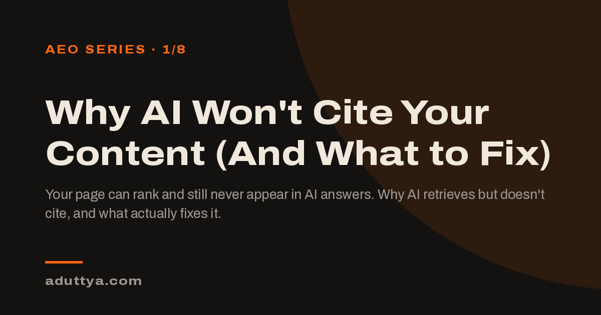

# Post OG images

Social preview cards (1200x630) for blog posts, used as `og_image` in each
post's front matter.

The `og-*.png` cards below are the "AEO Series" set — generated from the
`POST_CARDS` list in [`_scripts/make_og_cards.py`](../../../_scripts/make_og_cards.py),
which reproduces the site's dark studio gradient so the whole series reads
as one visual family while each title/subtitle stays distinct. Re-run
`python3 _scripts/make_og_cards.py` from the repo root after editing that
list to regenerate all cards.

| # | Post | File |
|---|------|------|
| 1 | Why AI Won't Cite Your Content | `og-why-ai-wont-cite.png` |
| 2 | Text Embeddings for AEO and SEO | `og-text-embeddings.png` |
| 3 | GEO / AEO Strategy Shift | `og-geo-aeo-strategy-shift.png` |
| 4 | Six Months of AEO Experiments | `og-six-months-aeo-experiments.png` |
| 5 | AEO Tracking Tells You If You're Winning | `og-aeo-tracking-verification.png` |
| 6 | Categories I Check Before Trusting an AI Recommendation | `og-aeo-optimization-categories.png` |
| 7 | SEO Automation That Doesn't Hallucinate | `og-seo-automation.png` (custom diagram, not from the script) |
| 8 | GT3 Knowledge Base: Apex Insights | `og-apex-insights-gt3.png` |

Example card:

Other files in this directory are in-post illustrations (diagrams,
screenshots) referenced directly from post bodies, not OG cards.
